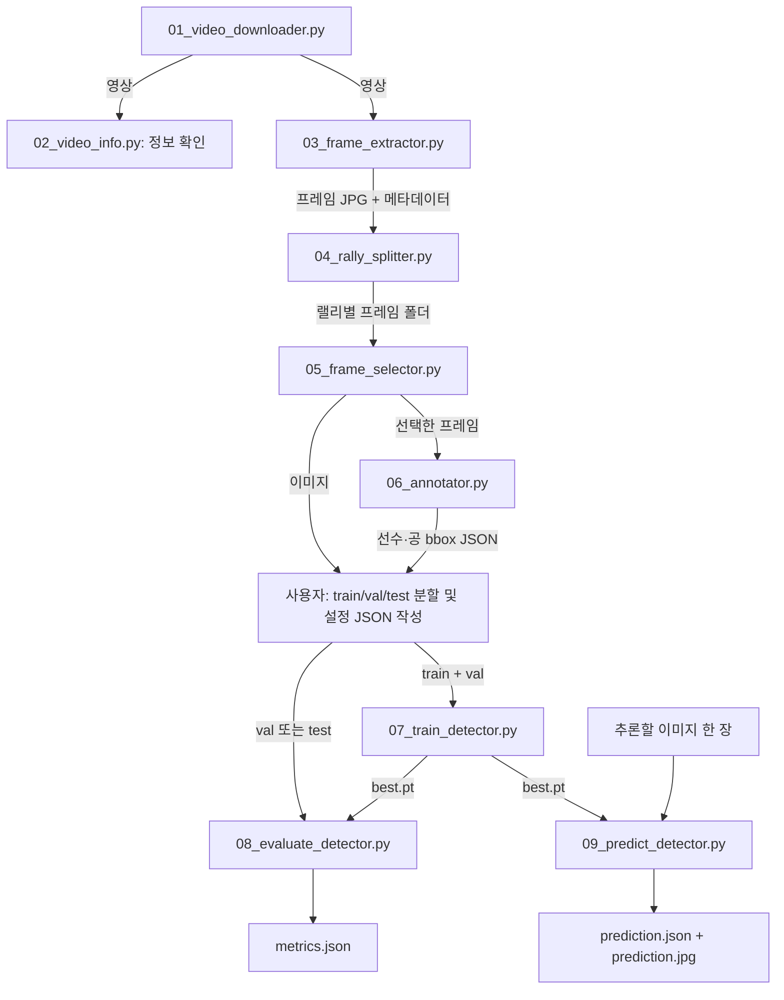

# 테니스 데이터 준비와 PyTorch 객체검출 CLI

파일명의 번호 순서대로 실행한다. 각 스크립트 상단에는 목적과 사용 예시가,
함수에는 처리 흐름과 저장 규칙을 설명하는 한국어 주석이 있다.
실행 예시는 프로젝트 루트 기준이며, 실제 데이터 경로로 바꿔 사용한다.

## 실행 순서

| 단계 | 스크립트 | 입력 → 출력 |
|---|---|---|
| 01 | `01_video_downloader.py` | YouTube URL → 영상 |
| 02 | `02_video_info.py` | 영상 → 해상도·FPS·재생시간 출력 |
| 03 | `03_frame_extractor.py` | 영상 → 프레임 JPG + `frames_metadata.json` |
| 04 | `04_rally_splitter.py` | 추출 프레임 → 랠리별 폴더 + `rally_metadata.json` |
| 05 | `05_frame_selector.py` | 개별 랠리 폴더 → 선택 프레임 + `selection_metadata.json` |
| 06 | `06_annotator.py` | 선택 프레임 → 선수 또는 공 bbox JSON |
| 07 | `07_train_detector.py` | 구성된 데이터셋 → 처음부터 학습한 CNN 가중치 |
| 08 | `08_evaluate_detector.py` | 가중치 + val/test 데이터 → 클래스별 검출 성능 |
| 09 | `09_predict_detector.py` | 가중치 + 이미지 한 장 → bbox JSON + 시각화 |

```bash
uv run python src/01_video_downloader.py "YOUTUBE_URL" --fps 25 --output datasets/videos/match01.mp4
uv run python src/02_video_info.py datasets/videos/match01.mp4
uv run python src/03_frame_extractor.py datasets/videos/match01.mp4 --fps 2 --output datasets/match01/frames
uv run python src/04_rally_splitter.py --frames datasets/match01/frames --output datasets/match01/rallies
uv run python src/05_frame_selector.py --frames datasets/match01/rallies/rally_0001 --output datasets/match01/selected/rally_0001
uv run python src/06_annotator.py --type player --frames datasets/match01/selected/rally_0001 --output datasets/match01/annotations/rally_0001_player.json
uv run python src/06_annotator.py --type ball --frames datasets/match01/selected/rally_0001 --output datasets/match01/annotations/rally_0001_ball.json

# train/val/test 데이터셋 구성 후, config의 경로를 실제 데이터 위치에 맞춘다.
uv run python src/07_train_detector.py --config configs/detector.example.json --output runs/detector01 --epochs 50 --batch-size 4 --image-size 512
uv run python src/08_evaluate_detector.py --weights runs/detector01/best.pt --config configs/detector.example.json --split test --output runs/detector01_test
uv run python src/09_predict_detector.py --weights runs/detector01/best.pt --image datasets/detection/test/images/000001.jpg --output runs/detector01_predict
```

다운로더의 FPS는 제공되는 영상 소스를 고르는 조건이다. `uv run yt-dlp -F "URL"`로
지원 형식을 먼저 확인할 수 있다. 별도 영상·오디오 병합에는 ffmpeg가 필요하다.
추출기의 FPS는 이미지 샘플링 빈도다. 예시의 2 FPS는 실행 예시이며 모델링 요구에 따라 정한다.

## 소스 파일 간 연결 관계

번호가 붙은 파일은 각각 실행하는 CLI다. 앞 스크립트가 다음 스크립트를 자동으로
호출하는 방식이 아니라, 저장한 파일·폴더를 다음 명령의 입력 경로로 전달한다.
02는 영상 정보를 확인하는 보조 단계이며, 08과 09는 07의 가중치를 각각 사용한다.
09를 실행하기 위해 08의 평가 결과가 필요한 것은 아니다.



06에서 생성한 라벨은 프레임 번호로 이미지와 연결된다. 데이터셋 설정 JSON에는
각 분할의 이미지 폴더와 선수·공 라벨 파일 경로를 지정한다. `detection/data.py`가
이를 읽어 이미지와 정답 bbox를 묶는다. 준비 단계의 메타데이터는 출처·선택 이력을
보관하며, 현재 검출 모델의 직접 학습 입력은 이미지와 bbox 라벨이다.

### 모델 내부 모듈의 역할

07~09는 실행 옵션과 입출력을 담당하고, 실제 모델 처리는 `detection/`의 모듈을
가져와 사용한다. 아래 표의 연결은 직접 호출뿐 아니라 `runtime.py`를 통한 호출도 포함한다.

| 소스 파일 | 역할과 연결 |
|---|---|
| [common.py](common.py) | 데이터 준비 CLI와 모델 CLI에서 프레임 이름 검증, 정렬, JSON 저장 등 공통 기능을 재사용한다. |
| [detection/data.py](detection/data.py) | 07·08에서 설정과 라벨을 읽고 배치를 구성한다. 이미지 크기 조정·여백 추가·정규화는 09에서도 같은 함수를 사용한다. |
| [detection/model.py](detection/model.py) | CNN 구조를 정의한다. 07은 무작위 초기화하고, 08·09는 `runtime.py`를 통해 같은 구조에 저장된 가중치를 불러온다. |
| [detection/loss.py](detection/loss.py) | 정답 bbox를 격자 목표값으로 변환하고 객체 존재·중심·크기 손실을 계산한다. 07의 학습·검증과 08의 평가에서 사용한다. |
| [detection/boxes.py](detection/boxes.py) | 모델 출력을 bbox와 점수로 변환하고 NMS로 중복 검출을 줄인다. 07·08의 성능 계산과 09의 추론에 사용하며, 09에서는 원본 이미지 좌표로 복원한다. |
| [detection/metrics.py](detection/metrics.py) | 예측 bbox와 정답을 비교해 AP50·precision·recall을 계산한다. `runtime.py`의 평가 함수가 호출한다. |
| [detection/runtime.py](detection/runtime.py) | 장치 선택, 한 epoch 학습, 평가, 체크포인트 저장·불러오기를 제공한다. 07~09가 필요한 기능을 공유한다. |

학습에서는 `data.py → model.py → loss.py` 순서로 계산한 손실을 역전파해
가중치를 갱신한다. 검증·평가에서는 모델 출력을 `boxes.py → metrics.py`로 전달해
성능을 계산한다. 단일 이미지 추론에서는 `data.py → model.py → boxes.py`를 거쳐
원본 좌표의 검출 결과를 저장한다. 이 흐름을 CLI와 `runtime.py`가 조율한다.

## 마우스와 키보드

| 도구 | 조작 |
|---|---|
| 랠리 분할 | A/D 이동, `[`/`]` 이동 폭 조절, S 시작, E 끝, N 랠리 저장, Q 종료 |
| 프레임 선택 | A/D 이동, `[`/`]` 이동 폭 조절, S 선택/해제, W 저장, Q 저장 후 종료 |
| bbox 라벨링 | 마우스 드래그로 박스 추가, A/D 이동, S 저장, R 현재 박스 초기화, Q 종료 |

라벨링에서 완성된 박스 변경은 프레임 이동과 종료 시 자동 저장된다.
S는 명시적으로 저장하며, 박스가 없는 프레임도 확인한 빈 라벨로 저장할 수 있다.
아무 작업도 하지 않은 프레임은 자동으로 빈 라벨이 되지 않는다.
선수와 공은 서로 다른 JSON 파일에 저장한다. 다른 클래스의 주석 파일을 열면 오류로 알려준다.

## 저장 규칙과 파일 구조

- 프레임 파일명의 숫자는 원본 영상의 프레임 번호다. 숫자 기준으로 정렬한다.
- 추출은 새 폴더 또는 빈 폴더만 허용한다. 재실행할 때 새 출력 폴더를 지정한다.
- 새 랠리는 기존 번호의 최댓값 다음 번호를 사용하며 기존 랠리에 병합하지 않는다.
- 프레임 선택의 입력·출력 폴더는 달라야 한다. 선택 해제는 출력의 복사본에만 적용한다.
- 메타데이터는 원본 영상 경로, 원본·샘플링 FPS 등을 다음 단계에 전달한다.
  메타데이터가 없는 과거 프레임도 사용할 수 있지만, 모르는 정보를 추정해서 채우지는 않는다.
- bbox JSON은 기존처럼 프레임 번호별 `objects`에 `class`, `x1`, `y1`, `x2`, `y2`를 저장한다.
  좌표는 이미지 픽셀 좌표이며, 화면의 박스 번호는 추적 ID가 아니다.
- `common.py`는 프레임 이름 검증·숫자 정렬·안전한 JSON 저장을 공유하는 보조 모듈이다.

## 데이터셋 구성 이후: 직접 만든 검출 모델 학습

07~09는 YOLO나 사전학습 가중치를 사용하지 않는다. PyTorch의 합성곱 레이어로
정의한 `TennisGridDetector`를 무작위 초기화부터 학습한다.
06의 출력에서 학습·검증·평가 분할을 구성하는 단계는 사용자가 완료했다고 가정한다.
코드가 데이터셋을 자동 분리하거나 가짜 데이터셋을 생성하지는 않는다.

위 명령의 `configs/detector.example.json`은 데이터 경로를 지정하는 예시 설정이다.
설정 내부의 상대 경로는 설정 파일이 있는 폴더 기준이며, `--image`는 실제 존재하는
이미지 파일로 바꾼다. 07~09의 `--output`은 매 실행마다 새 폴더를 지정한다.

- 07: `train`으로 학습하고 `val`로 검증해 `best.pt`, `last.pt`, 학습 이력을 저장한다.
- 08: `best.pt`를 불러와 `test` 성능을 `metrics.json`에 저장한다. 검증 데이터로
  평가하려면 `--split val`로 바꾼다.
- 09: 이미지 한 장의 검출 결과를 `prediction.json`과 `prediction.jpg`로 저장한다.

모델 구조, 라벨 형식, 실행 예시, 평가 지표와 한계는
[detection/README.md](detection/README.md)를 참고한다.

## 코드 스타일 확인

프로젝트 가상환경에서 코드 스타일을 확인한다.

```bash
uv run ruff check src
uv run ruff format --check src
```
